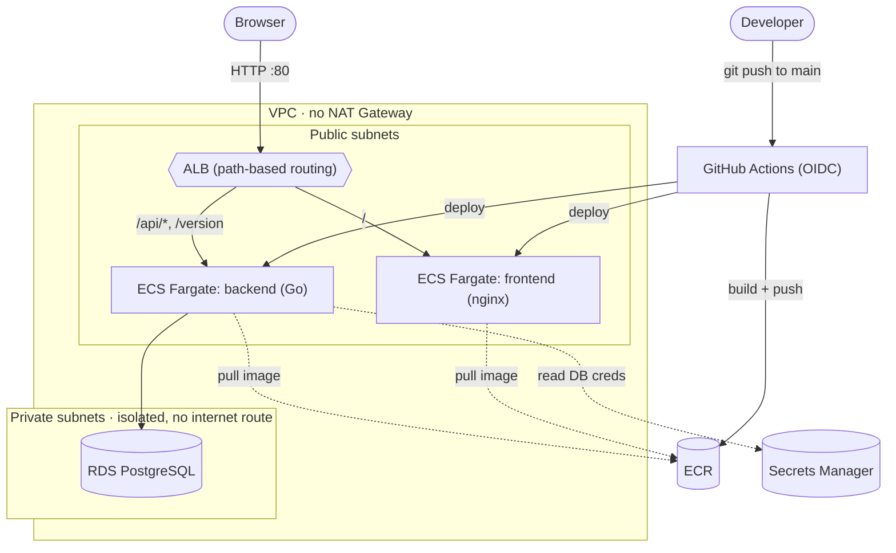

# Robin — DevOps Technical Challenge

A minimal full-stack app (frontend → API → database), containerized and deployed to AWS with
Terraform and a GitHub Actions CI/CD pipeline.

## Live URLs

Both services sit behind the same ALB, split by path (see "ALB with path-based routing" below).

- Frontend: http://robin-alb-38259096.us-east-1.elb.amazonaws.com/
- Backend: http://robin-alb-38259096.us-east-1.elb.amazonaws.com/api/quote,
  http://robin-alb-38259096.us-east-1.elb.amazonaws.com/version

## Architecture

Solid arrows are runtime request traffic; dashed arrows are pulling an image or reading a secret.
Security group rules (who can reach what) are covered in "Infrastructure" below.



## Stack

| Layer    | Choice                          | Why |
|----------|----------------------------------|-----|
| Frontend | Static HTML + vanilla JS, served by nginx | The app itself isn't what's being evaluated — kept it dependency-free, no build step |
| Backend  | Go                                | Compiles to a static binary, tiny final image, no runtime needed |
| Database | PostgreSQL                        | Simple, well-known, free-tier eligible on RDS |
| Local DB | `postgres:16-alpine` container (docker-compose only) | Lets the whole stack run locally without touching AWS. In the cloud this is replaced by a managed RDS instance — same backend code, only the connection env vars change |

## Running locally

```bash
cp .env.example .env
docker compose up -d --build
```

- Frontend: http://localhost:3000
- Backend (direct): http://localhost:8080

## Decisions and why

### Backend
- Go, compiled to a static binary (`CGO_ENABLED=0`) in a multi-stage Dockerfile, final image is
  `gcr.io/distroless/static-debian12:nonroot` — no shell, no package manager, runs as a non-root
  user by default. Final image is ~12MB.
- Three endpoints: `/health` (liveness), `/version` (returns the git SHA injected at build time
  via `-ldflags`, used later to visually confirm the CI/CD pipeline actually deployed a new
  version), `/api/quote` (reads a random row from Postgres — a real DB round-trip, not a mock).
- DB credentials are read entirely from environment variables, nothing hardcoded. Locally they
  come from `.env` (gitignored); in AWS they'll come from Secrets Manager via the ECS task
  definition.
- Seeding is idempotent (only inserts if the table is empty), so restarting the container never
  duplicates rows.
- Graceful shutdown on SIGTERM — ECS sends SIGTERM on deploys/scale-in and expects the container
  to exit cleanly within the stop timeout.

### Frontend
- No framework, no build step: a single `index.html` with vanilla JS. The app's complexity isn't
  what's being evaluated, so this keeps the Dockerfile trivial and the image small (~48MB, mostly
  the nginx base).
- Served by `nginxinc/nginx-unprivileged` instead of the default `nginx` image — runs as a
  non-root user on port 8080 out of the box.
- nginx proxies `/api/*` and `/version` to the backend container via a templated config
  (`envsubst`). This proxy only matters locally: docker-compose has no load balancer, so the
  browser can only reach nginx. In AWS, the ALB routes those same paths directly to the backend
  target group, bypassing the frontend container entirely — same paths, same code, no changes
  needed between environments.

### Infrastructure
- **Networking, no NAT Gateway**: ECS tasks run in public subnets with their own public IP
  (needed to pull images from ECR and reach Secrets Manager without a NAT Gateway), but a
  Security Group only allows inbound traffic from the ALB's SG on the container port — nothing
  else can reach them directly. RDS sits in private/isolated subnets with no route to the
  internet at all, reachable only from the ECS tasks' SG on 5432. A NAT Gateway would add a
  genuine extra layer of defense-in-depth (tasks would be physically unreachable from the
  internet even if the SG were ever misconfigured), but costs ~$32/month and isn't free-tier
  eligible — not worth it for infra that lives a couple of days and gets destroyed after review.
- **2 AZs, not 1**: not a choice — both the ALB and the RDS subnet group require subnets in at
  least two Availability Zones to be created at all, even with `multi_az = false`.
- **Secrets**: DB master password is a `random_password`, never written in code. It's stored in
  Secrets Manager as JSON (host/user/password/dbname), and the ECS task definition injects each
  field individually via the `secrets` block — the value never appears in plain text in
  Terraform state diffs shown to a human, task definition JSON, or logs.
- **IAM**: the ECS task execution role only gets the AWS-managed `AmazonECSTaskExecutionRolePolicy`
  (ECR pull + CloudWatch Logs) plus one inline statement scoped to `secretsmanager:GetSecretValue`
  on that single secret's ARN — nothing broader. The Terraform Cloud deployer itself also runs as
  a dedicated IAM user with a custom policy scoped to the services actually used here, instead of
  the personal admin account — that policy is applied by hand, not by this Terraform, for a
  chicken-and-egg reason: see [`infra/bootstrap/README.md`](infra/bootstrap/README.md).
- **ALB with path-based routing**: one load balancer, `/` → frontend target group, `/api/*` and
  `/version` → backend target group. Gives a single stable URL that survives redeploys (Fargate
  tasks get a new IP every deployment) instead of sharing two unstable IPs.
- **CI/CD vs. Terraform ownership of the running image**: `aws_ecs_service` uses
  `lifecycle { ignore_changes = [task_definition] }` and `wait_for_steady_state = false`. Terraform
  owns the initial task definition revision (needed for `apply` to succeed before any image has
  ever been pushed); every push to `main` after that registers a new revision via CI/CD without
  Terraform trying to revert it on the next `apply`.

### CI/CD
- **GitHub Actions, OIDC instead of access keys**: the workflow authenticates to AWS via a
  federated IAM role (`robin-github-actions-deployer`), not a static access key stored as a
  GitHub Secret. GitHub signs a short-lived token per run; the role's trust policy only accepts
  one whose `sub` claim is literally `repo:faqsarg/robin:ref:refs/heads/main` — no other repo,
  fork, or branch can assume it. No AWS credential is stored anywhere in GitHub.
- **The OIDC provider is read, not created**: it's an AWS account-level singleton (one per URL
  per account) and one already existed here for another project. Terraform only reads it via a
  `data` source and owns its own role — the same shared-provider pattern a platform team would
  use for multiple projects in one AWS account.
- **The deploy role's permissions are scoped to exactly 5 actions it needs**: push to the two ECR
  repos, register/describe task definitions (these two ECS actions don't support resource-level
  scoping - an AWS limitation, not a choice), update the two specific ECS services, and
  `iam:PassRole` on just the ECS execution role. Nothing else.
- **Matrix build**: one job definition, run twice in parallel (frontend/backend) via a build
  matrix, instead of duplicating every step.
- **Terraform still owns the infra, CI/CD owns the running image**: each push builds the image,
  tags it with the short git SHA, registers a new task definition revision pointing at it, and
  calls `update-service --force-new-deployment` — the same manual sequence used to bootstrap the
  first deploy, now automated. `aws ecs wait services-stable` at the end means the workflow only
  goes green once the new version is actually running and healthy, not just pushed.

## What I'd improve with more time

- **`terraform plan` on every infra PR, `apply` gated behind manual approval.** The challenge only
  asks for the app to deploy automatically, not infra changes — and I wouldn't auto-apply
  Terraform blindly even with more time: a bad infra change can take down or misconfigure real
  resources (a database, a security group), which is a different risk than a bad app deploy. Plan
  automatically so the diff is visible on every PR; keep `apply` a conscious, human step.
- **HTTPS with a real domain.** The ALB only serves plain HTTP right now — anyone visiting the URL
  gets flagged "not secure" by the browser. This wasn't a design choice, just a side effect of not
  having a domain for a throwaway challenge; with one, it's an ACM certificate + an HTTPS listener
  on the ALB.
- **Monitoring and alerts.** There are logs, but nothing that notices when something breaks — if a
  service started failing at 3am, nobody would know until someone checked by hand. CloudWatch
  Alarms on real signals (ALB 5xx rate, ECS tasks below `desired_count`, failed health checks)
  wired to SNS would close that gap, using metrics AWS already collects for free — no new
  infrastructure needed. A stack like Prometheus/Grafana would be overkill at this size; that
  makes more sense once there are several services or custom business metrics to track.

## Use of AI tools

Used Claude (Claude Code) as a pair-programmer throughout, in an interactive back-and-forth
rather than "generate everything and accept it" — this section is updated as the project
progresses.

**What it was used for so far:**
- Generating first drafts of the Go API, Dockerfiles, nginx config, and `docker-compose.yml`
  from a description of what each piece needed to do.
- Design discussion before writing infra code: e.g., whether to put an ALB in front of ECS
  Fargate at all (tradeoff: stable URL across redeploys vs. cost) and how to avoid a NAT Gateway
  (not free-tier) while still keeping the RDS instance unreachable from the public internet.

**A concrete decisive prompt:** 

**What I did with what it gave me:** 

**Decisions made explicitly without relying on AI's first suggestion:** the initial stack
proposal was Node.js/Express + React on GCP. I overrode both — chose Go for the backend (smaller
image, no runtime, and it's what I wanted to demonstrate) and a build-free vanilla JS frontend
instead of React, and picked AWS/ECS Fargate over GCP/Cloud Run since it's the stack I am more 
comfortable with.

**Where AI got something wrong:** three real issues, all only caught by actually testing on AWS
instead of trusting that things worked:

1. **nginx crashed on startup in ECS.** The original config pointed nginx at `backend:8080` to
   reach the API. That hostname only exists inside docker-compose's own network — in AWS it
   doesn't exist anywhere. nginx tries to look up that address the moment it starts, so the
   container just never came up. Found it by checking the CloudWatch logs after noticing the ECS
   service had zero running tasks.
2. **The fix introduced a second, sneakier bug.** The fix was to make nginx look up that address
   later, per request, instead of once at startup. That solved the crash — but as a side effect,
   nginx started silently forwarding `/api/quote` to the backend as just `/api/`, a 404. Only
   caught this by testing each route by hand (`curl -v` on every one), instead of assuming
   "container is running" meant "the app works." `/version` happened to still work by luck, which
   would have hidden the bug entirely if that were the only route checked.
3. **A different kind of miss: stale knowledge, not a logic bug.** The GitHub Actions OIDC role
   kept failing to assume with `AccessDenied`, for no reason visible in the Terraform code - the
   trust policy looked correct. The cause was a GitHub platform change from 2026-04-23 (after the
   assistant's training cutoff): repos created after 2026-07-15 get an OIDC `sub` claim in an
   immutable `repo:OWNER@OWNER-ID/REPO@REPO-ID` format instead of plain names, specifically to
   stop a recycled username/repo from inheriting an old trust policy. The assistant didn't guess
   or patch around it - it read the actual denied request from AWS CloudTrail, saw the real `sub`
   claim AWS received, and cross-checked it against GitHub's API and changelog before touching
   the trust policy.

## Cleanup

Once evaluated, all AWS infrastructure was destroyed with `terraform destroy`. If a live URL was
shared as evidence, it was taken down after the review.
